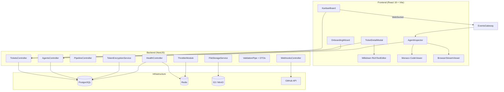

# Design Document: Spec Gap Implementation

## Overview

This design covers the implementation of 18 requirements that bridge the gap between the Runa product specification and the current codebase. The work spans four phases:

1. **Phase 1 (Core Feature Gaps):** Play button on tickets, Milkdown rich text editor for descriptions and comments, execution history viewer, pipeline progression prompts, ticket state transition history.
2. **Phase 2 (Agent Inspection & Observability):** Monaco live code viewer, Playwright browser session viewer, pixel art agent avatars.
3. **Phase 3 (GitHub Integration & Security):** AES-256-GCM token encryption, PR creation, GitHub webhooks listener, input validation with DTOs + rate limiting, TypeORM migrations.
4. **Phase 4 (Infrastructure & Polish):** S3/MinIO file storage, onboarding wizard, CI/CD GitHub Actions, structured logging + health checks.

The existing stack is NestJS + TypeORM + PostgreSQL + Redis (backend) and React 19 + Vite + Tailwind CSS v4 + React Query + socket.io (frontend). The design preserves existing patterns (event-emitter-driven pipeline, WebSocket gateway, React Query cache invalidation) and extends them.

## Architecture



### Key Architectural Decisions

1. **Milkdown (MIT licensed)** — Milkdown is a fully open-source, plugin-driven Markdown editor built on ProseMirror and Remark. Content stored as Markdown natively (no conversion layer needed). React integration via `@milkdown/react`. Extensible via plugins for images, task lists, code blocks, etc.

2. **JSONB for transition history** — Adding a `statusHistory` JSONB column to the ticket entity avoids a new join table while keeping queries simple. Each entry is `{ from, to, timestamp, trigger }`.

3. **AES-256-GCM encryption** — Uses Node.js `crypto` module directly. The IV is prepended to the ciphertext and stored as a single base64 string. The auth tag is appended. No external encryption library needed.

4. **@nestjs/throttler with Redis** — Rate limiting uses the official NestJS throttler module with `@nestjs/throttler/dist/storages/redis.storage` for distributed deployments. Two tiers: standard (100/min) and agent invocation (10/min).

5. **MinIO for local dev** — Added as a docker-compose service. The `FileStorageService` uses the AWS SDK v3 `@aws-sdk/client-s3` which is compatible with both S3 and MinIO.

6. **Monaco Editor via @monaco-editor/react** — Read-only viewer for live code diffs. File change events streamed via existing WebSocket gateway with a new `file_change` event type.

7. **Browser session viewer** — Screenshots streamed as base64 JPEG via WebSocket at ~2fps. No video streaming infrastructure needed; simple image replacement in an `` tag.

## Components and Interfaces

### Phase 1 Components

#### 1. Play Button (Req 1)

**Frontend: `TicketCard.tsx` modification**

- Add `onPlay(ticketId)` handler to the existing `<FiPlay>` button
- Call `POST /tickets/:id/trigger-agent` endpoint
- Show spinner on the play button while agent is active (subscribe to `agent_status` WebSocket event)
- Disable button when ticket status is `backlog` or `done`

**Backend: `TicketsController` + `PipelineService` extension**

- New endpoint: `POST /tickets/:id/trigger-agent`
- `PipelineService.triggerAgentForTicket(ticketId)` determines agent from `STAGE_AGENT_MAP` and invokes it
- Returns `{ queued: true, agentType }` or `{ error: 'no_mapped_agent' }`
- If agent is busy (`activeRuns.has`), queue the request and return `{ queued: true }`

**New hook: `useTriggerAgent`**

```typescript
useMutation({
  mutationFn: (ticketId: string) =>
    api.post(`/tickets/${ticketId}/trigger-agent`),
});
```

#### 2. Rich Text Editor — Descriptions (Req 2)

**New component: `frontend/src/components/RichTextEditor.tsx`**

- Wraps Milkdown with `@milkdown/react` using `useEditor` hook
- Plugins: `@milkdown/preset-commonmark` (headings, bold, italic, code blocks, lists, links), `@milkdown/preset-gfm` (task lists, tables, strikethrough), `@milkdown/plugin-listener` (onChange callback), `@milkdown/plugin-upload` (image paste/drop)
- Props: `content: string`, `onChange: (markdown: string) => void`, `readonly: boolean`
- Image upload: on paste/drop, the upload plugin calls `POST /files/upload` then inserts ``
- Milkdown works with Markdown natively — no conversion layer needed

**TicketDetailModal modification:**

- Replace `<textarea>` with `<RichTextEditor>`
- Add edit/preview toggle button
- Read-only mode uses Milkdown with `readonly={true}`

**New packages (frontend):** `@milkdown/core`, `@milkdown/react`, `@milkdown/preset-commonmark`, `@milkdown/preset-gfm`, `@milkdown/plugin-listener`, `@milkdown/plugin-upload`, `@milkdown/theme-nord` (or `@milkdown/theme-tokyo`), `@milkdown/ctx`

#### 3. Rich Text Comments (Req 3)

**TicketDetailModal modification:**

- Add comment input area using a smaller `<RichTextEditor>` instance
- Submit button calls `POST /tickets/:id/comments` with `{ content: markdownString }`
- Existing comments rendered with `<RichTextEditor readonly={true} content={comment.content} />`

**Backend: New endpoint**

- `POST /tickets/:id/comments` — appends to the JSONB `comments` array
- Comment shape: `{ id: uuid, authorType, authorId, content, createdAt }`

#### 4. Execution History (Req 4)

**New component: `frontend/src/features/agents/AgentInspector.tsx`**

- Opens as a slide-over panel when clicking an agent badge in `AgentPanel`
- Fetches `GET /agents/:agentId/executions?page=1&limit=20`
- Displays chronological list: timestamp, tool name, input summary, status badge
- Expandable rows show full tool input/output JSON
- Live mode: subscribes to `execution_action` WebSocket event for real-time log streaming

**Backend: `AgentsController` extension**

- `GET /agents/:agentId/executions` — paginated query on `executions` table, ordered by `startTime DESC`
- Response: `{ data: Execution[], total: number, page: number }`

**WebSocket: New event `execution_action`**

- Emitted by agent services during execution loop when a tool_use block is processed
- Payload: `{ executionId, agentId, tool, inputSummary, timestamp }`

#### 5. Pipeline Progression Prompts (Req 5)

**New component: `frontend/src/components/PipelinePrompt.tsx`**

- Banner displayed in `TicketDetailModal` when `pipeline_completed` event fires
- Two buttons: "Advance to next stage" → `POST /tickets/:id/advance`, "Run full pipeline" → `POST /tickets/:id/run-pipeline`
- Also shown as a toast notification on the board via WebSocket

**Backend: `PipelineController` extension**

- `POST /tickets/:id/advance` — moves to next enabled stage, triggers agent if mapped
- `POST /tickets/:id/run-pipeline` — sequentially advances through all remaining stages

**WebSocket: New event `pipeline_completed`**

- Emitted when an agent finishes execution
- Payload: `{ ticketId, completedStage, nextStage, agentType }`

#### 6. Ticket State Transition History (Req 6)

**Ticket entity modification:**

- Add `statusHistory` JSONB column: `Array<{ from: string, to: string, timestamp: string, trigger: 'user' | 'agent' | 'pipeline' }>`

**TicketsService modification:**

- `moveTicket()` and `update()` append to `statusHistory` before saving
- Include `trigger` parameter to distinguish user drag vs agent vs pipeline

**TicketDetailModal modification:**

- New `<TransitionTimeline>` component below description
- Renders vertical timeline with status badges, timestamps, and trigger icons

### Phase 2 Components

#### 7. Live Code Viewer (Req 7)

**New component: `frontend/src/features/agents/MonacoCodeViewer.tsx`**

- Uses `@monaco-editor/react` in read-only mode
- Subscribes to `file_change` WebSocket event
- Applies diff decorations (green/red line highlights) using Monaco's `deltaDecorations` API
- Language auto-detected from file extension

**Backend: Agent service modification**

- During execution loop, when a `Write` or `Edit` tool_use is detected, emit `file_change` event via WebSocket
- Payload: `{ executionId, filePath, content, diff: { additions: number[], deletions: number[] } }`

**New packages (frontend):** `@monaco-editor/react`

#### 8. Browser Session Viewer (Req 8)

**New component: `frontend/src/features/agents/BrowserStreamViewer.tsx`**

- Displays `` tag that updates src from `browser_screenshot` WebSocket events
- Shows "Session ended" overlay when `browser_session_end` event fires
- Placeholder when no active session

**Backend: TesterAgentService modification**

- Hook into Playwright MCP server screenshot events
- Forward screenshots as base64 JPEG via `browser_screenshot` WebSocket event at ~2fps
- Emit `browser_session_end` when Playwright session closes

#### 9. Pixel Art Avatars (Req 9)

**Static assets:** `frontend/public/avatars/pm.png`, `developer.png`, `tester.png`

- 64x64 pixel art PNGs

**AgentPanel, ChatPanel, TicketDetailModal modifications:**

- Replace colored circle + text label with ``
- Add status ring: CSS `ring-2` with color based on agent status (gray=idle, green pulsing=active, red=error)

### Phase 3 Components

#### 10. Token Encryption Service (Req 10)

**New service: `backend/src/common/token-encryption.service.ts`**

```typescript
interface TokenEncryptionService {
  encrypt(plaintext: string): string; // Returns base64(iv + ciphertext + authTag)
  decrypt(encrypted: string): string; // Returns plaintext
}
```

- Uses `crypto.createCipheriv('aes-256-gcm', key, iv)` with random 12-byte IV
- Key derived from `ENCRYPTION_KEY` env var (32-byte hex string)
- Startup guard in `main.ts`: if `ENCRYPTION_KEY` is missing, throw and refuse to start

**AuthService modification:**

- Call `encrypt()` before storing `githubTokenEncrypted`
- Call `decrypt()` in `GithubService.getToken()` before using the token

#### 11. GitHub PR Creation (Req 11)

**GithubService extension:**

```typescript
async createPullRequest(spaceId: string, branchName: string, ticketId: string): Promise<{ url: string }>
```

- Uses GitHub REST API `POST /repos/{owner}/{repo}/pulls`
- Title format: `[{ticketId}] {ticketTitle}`
- Body includes ticket description + agent summary + link back to Runa

**Ticket entity modification:**

- Add `prUrl` column (nullable string)

**DeveloperAgentService modification:**

- After pushing branch, call `githubService.createPullRequest()`
- Store PR URL on ticket, display in `TicketDetailModal`

#### 12. GitHub Webhooks (Req 12)

**New controller: `backend/src/webhooks/webhooks.controller.ts`**

- `POST /webhooks/github` — raw body access for HMAC-SHA256 verification
- Validates `X-Hub-Signature-256` header against `GITHUB_WEBHOOK_SECRET` env var
- Handles `pull_request` (merged → move ticket to staged) and `push` (emit WebSocket event) events
- Ignores unrecognized repos

**New module: `backend/src/webhooks/webhooks.module.ts`**

#### 13. Input Validation & Rate Limiting (Req 13)

**DTOs for all controllers:**

- `CreateTicketDto`, `UpdateTicketDto`, `MoveTicketDto`
- `CreateSpaceDto`, `UpdateSpaceDto`
- `SendChatMessageDto`
- `CreateRuleDto`, `UpdateRuleDto`
- All use `class-validator` decorators (`@IsString`, `@IsNotEmpty`, `@IsOptional`, `@IsEnum`, etc.)

**Global ValidationPipe:**

- Added in `main.ts`: `app.useGlobalPipes(new ValidationPipe({ whitelist: true, transform: true }))`

**Rate Limiting:**

- `@nestjs/throttler` module with Redis storage
- Default: `{ ttl: 60000, limit: 100 }` for standard endpoints
- Agent invocation endpoints: `@Throttle({ default: { ttl: 60000, limit: 10 } })`
- Returns 429 with `Retry-After` header

**New packages (backend):** `@nestjs/throttler`

#### 14. Database Migrations (Req 14)

**New file: `backend/src/data-source.ts`**

- TypeORM DataSource config for CLI usage
- Reads from env vars, sets `synchronize: false`

**AppModule modification:**

- `synchronize` conditional: `config.get('NODE_ENV') === 'production' ? false : true`

**Initial migration:**

- `backend/src/migrations/` directory
- One migration file creating all 9 existing tables

**package.json scripts** (already present, just need `data-source.ts`):

- `migration:generate`, `migration:run`

### Phase 4 Components

#### 15. File Storage Service (Req 15)

**New service: `backend/src/common/file-storage.service.ts`**

```typescript
interface FileStorageService {
  upload(
    file: Buffer,
    metadata: {
      spaceId: string;
      entityType: string;
      entityId: string;
      extension: string;
    },
  ): Promise<{ key: string; url: string }>;
  getSignedUrl(key: string): Promise<string>;
}
```

- Uses `@aws-sdk/client-s3` + `@aws-sdk/s3-request-presigner`
- Key pattern: `{spaceId}/{entityType}/{entityId}/{uuid}.{extension}`
- Configured via `S3_ENDPOINT`, `S3_BUCKET`, `AWS_ACCESS_KEY_ID`, `AWS_SECRET_ACCESS_KEY`

**New controller: `backend/src/common/files.controller.ts`**

- `POST /files/upload` — multipart form upload, returns `{ url }`
- `GET /files/:key` — proxy or redirect to signed URL

**docker-compose.yml modification:**

- Add MinIO service with pre-configured bucket

**New packages (backend):** `@aws-sdk/client-s3`, `@aws-sdk/s3-request-presigner`

#### 16. Onboarding Wizard (Req 16)

**New component: `frontend/src/features/onboarding/OnboardingWizard.tsx`**

- 3-step wizard: Create Space → Connect GitHub Repo → Configure Pipeline
- Step 2 (GitHub) is skippable
- On completion, creates space via `POST /spaces` and navigates to board

**SpaceListPage modification:**

- If `spaces.length === 0`, render `<OnboardingWizard>` instead of empty list

**Reuses existing hooks:** `useCreateSpace`, `useGithubRepos`, `useUpdatePipelineConfig`

#### 17. CI/CD Pipeline (Req 17)

**New files:**

- `.github/workflows/ci.yml` — runs on push to main + PRs: install, lint, type-check, test, build Docker images
- `.github/workflows/deploy.yml` — deploys to EC2 via SSH after successful CI on main

#### 18. Monitoring & Logging (Req 18)

**New controller: `backend/src/health/health.controller.ts`**

- `GET /health` — checks PostgreSQL and Redis connectivity
- Returns `{ status: 'ok', db: 'up', redis: 'up' }` or 503 with failing dependency

**Logging:**

- Configure NestJS logger to output JSON in production (`NODE_ENV=production`)
- Add request logging middleware: method, path, status code, response time
- Agent execution logging: start/complete/fail with executionId, agentType, ticketId, duration

**New module: `backend/src/health/health.module.ts`**

## Data Models

### Modified Entities

#### Ticket Entity (modified)

```typescript
// New columns added to existing Ticket entity
@Column({ type: 'jsonb', default: [] })
statusHistory: Array<{
  from: string;
  to: string;
  timestamp: string;
  trigger: 'user' | 'agent' | 'pipeline';
}>;

@Column({ type: 'text', nullable: true })
prUrl: string;
```

#### User Entity (modified)

```typescript
// githubTokenEncrypted column already exists
// Change: value will now be AES-256-GCM encrypted (base64 of iv+ciphertext+authTag)
// instead of plaintext token
```

### New DTOs

```typescript
// CreateTicketDto
class CreateTicketDto {
  @IsString() @IsNotEmpty() title: string;
  @IsString() @IsOptional() description?: string;
  @IsEnum(["low", "medium", "high", "critical"])
  @IsOptional()
  priority?: string;
  @IsEnum(["backlog", "development", "review", "testing", "staged", "done"])
  @IsOptional()
  status?: string;
}

// UpdateTicketDto
class UpdateTicketDto {
  @IsString() @IsOptional() title?: string;
  @IsString() @IsOptional() description?: string;
  @IsEnum(["low", "medium", "high", "critical"])
  @IsOptional()
  priority?: string;
}

// MoveTicketDto
class MoveTicketDto {
  @IsEnum(["backlog", "development", "review", "testing", "staged", "done"])
  status: string;
}

// CreateCommentDto
class CreateCommentDto {
  @IsString() @IsNotEmpty() content: string;
}

// TriggerAgentDto (empty body, ticketId from URL)

// CreateSpaceDto
class CreateSpaceDto {
  @IsString() @IsNotEmpty() name: string;
  @IsString() @IsOptional() githubRepoUrl?: string;
}

// UpdatePipelineConfigDto
class UpdatePipelineConfigDto {
  @IsObject() config: Record<string, boolean>;
}

// SendChatMessageDto
class SendChatMessageDto {
  @IsString() message: string;
  @IsEnum(["pm", "developer", "tester"]) agentType: string;
}
```

### WebSocket Event Payloads

```typescript
// execution_action — live agent action streaming
{ executionId: string, agentId: string, tool: string, inputSummary: string, timestamp: string }

// pipeline_completed — agent finished work
{ ticketId: string, completedStage: string, nextStage: string | null, agentType: string }

// file_change — live code changes from developer agent
{ executionId: string, filePath: string, content: string, diff: { additions: number[], deletions: number[] } }

// browser_screenshot — tester agent browser frame
{ executionId: string, screenshot: string /* base64 JPEG */, timestamp: string }

// browser_session_end
{ executionId: string, timestamp: string }

// github_push — new commit on default branch
{ spaceId: string, commitSha: string, commitMessage: string, author: string }
```

### File Storage Key Schema

```
{spaceId}/{entityType}/{entityId}/{uuid}.{extension}
```

Example: `abc-123/ticket/def-456/a1b2c3d4.png`

### Encryption Format

```
Base64( IV[12 bytes] || Ciphertext || AuthTag[16 bytes] )
```

## Correctness Properties

_A property is a characteristic or behavior that should hold true across all valid executions of a system — essentially, a formal statement about what the system should do. Properties serve as the bridge between human-readable specifications and machine-verifiable correctness guarantees._

### Property 1: Status-to-agent mapping determines play button state

_For any_ ticket status, the play button is enabled if and only if the status has a mapped agent in `STAGE_AGENT_MAP` (development → developer, testing → tester). For statuses without a mapping (backlog, review, staged, done), the play button must be disabled.

**Validates: Requirements 1.1, 1.4**

### Property 2: Markdown editor round-trip preserves content

_For any_ valid Markdown string containing headings, bold, italic, code blocks, lists, checkboxes, and links, loading it into Milkdown's editor and extracting the Markdown back should produce semantically equivalent content. Since Milkdown works with Markdown natively (via Remark), the round-trip should be lossless for supported syntax.

**Validates: Requirements 2.5**

### Property 3: Comment persistence round-trip

_For any_ comment with valid Markdown content, saving it via the comment API and then fetching the ticket should return a comment with the same Markdown content string.

**Validates: Requirements 3.4**

### Property 4: Execution history is chronologically ordered with required fields

_For any_ agent with one or more executions, the `GET /agents/:agentId/executions` endpoint should return entries ordered by `startTime` descending, and each entry must contain: `id`, `startTime`, `status`, and `actionLog` (array of objects each with `tool`, `input`, `timestamp`).

**Validates: Requirements 4.2**

### Property 5: Execution pagination returns correct page sizes

_For any_ agent with N executions and any valid page/limit parameters, the paginated response should contain at most `limit` items, the `total` should equal N, and the `page` should match the requested page number.

**Validates: Requirements 4.4**

### Property 6: Pipeline advance moves ticket to next enabled stage

_For any_ ticket at a given pipeline stage and any pipeline configuration, calling "advance to next stage" should move the ticket to the next stage that is enabled in the pipeline config, skipping disabled stages.

**Validates: Requirements 5.2**

### Property 7: Full pipeline run reaches final enabled stage

_For any_ ticket at a starting stage and any pipeline configuration with at least one enabled stage ahead, running the full pipeline should result in the ticket reaching the last enabled stage in the pipeline sequence.

**Validates: Requirements 5.3**

### Property 8: Status transitions are recorded with correct metadata

_For any_ ticket and any status change operation, the `statusHistory` JSONB array should grow by exactly one entry, and that entry must contain the correct `from` (previous status), `to` (new status), a valid ISO timestamp, and the correct `trigger` source ('user', 'agent', or 'pipeline').

**Validates: Requirements 6.1, 6.3**

### Property 9: Agent status maps to correct avatar ring color

_For any_ agent status value ('idle', 'active', 'error'), the status ring CSS class mapping function should return the correct color: gray for idle, green (pulsing) for active, red for error. No other status values should be accepted.

**Validates: Requirements 9.3**

### Property 10: Token encryption round-trip and ciphertext differs from plaintext

_For any_ non-empty string token, encrypting it with `TokenEncryptionService.encrypt()` and then decrypting with `TokenEncryptionService.decrypt()` should return the original token. Additionally, the encrypted output must not equal the plaintext input.

**Validates: Requirements 10.1, 10.3**

### Property 11: PR title and body contain required ticket information

_For any_ ticket with a non-empty title, ID, and description, the generated PR title should match the format `[{ticketId}] {ticketTitle}`, and the generated PR body should contain the ticket description and a URL linking back to the ticket.

**Validates: Requirements 11.2, 11.3**

### Property 12: Webhook HMAC-SHA256 signature verification

_For any_ webhook payload and secret, computing the HMAC-SHA256 signature and verifying it should succeed. For any payload with a tampered signature (even a single bit change), verification should fail.

**Validates: Requirements 12.1**

### Property 13: Webhook ignores unrecognized repositories

_For any_ webhook payload containing a repository URL that does not match any space's `githubRepoUrl`, the webhook handler should return early without modifying any ticket status.

**Validates: Requirements 12.4**

### Property 14: DTO validation rejects invalid input with HTTP 400

_For any_ POST/PATCH endpoint and any request body that violates the DTO constraints (missing required fields, wrong types, invalid enum values), the endpoint should return HTTP 400 with an error response containing descriptive validation messages.

**Validates: Requirements 13.1, 13.2**

### Property 15: Rate limiting enforces request threshold

_For any_ API endpoint with a configured rate limit of N requests per time window, the (N+1)th request within the window should receive HTTP 429 with a `Retry-After` header.

**Validates: Requirements 13.3**

### Property 16: File storage key follows naming pattern

_For any_ combination of spaceId, entityType, entityId, and file extension, the generated storage key should match the pattern `{spaceId}/{entityType}/{entityId}/{uuid}.{extension}` where uuid is a valid UUID v4.

**Validates: Requirements 15.2**

### Property 17: Onboarding wizard step advancement

_For any_ wizard step (1, 2, or 3), performing either "complete" or "skip" should advance the wizard to the next step. Skipping step 2 (GitHub connection) should not block progression to step 3.

**Validates: Requirements 16.5**

### Property 18: Agent execution log contains required fields

_For any_ agent execution event (start, complete, or fail), the structured log output should contain: `executionId`, `agentType`, `ticketId`, and `duration` (for complete/fail events).

**Validates: Requirements 18.3**

### Property 19: Request log contains required fields

_For any_ HTTP request processed by the logging middleware, the structured log output should contain: `method`, `path`, `statusCode`, and `responseTime`.

**Validates: Requirements 18.4**

## Error Handling

### Backend Error Handling

| Scenario                       | HTTP Code     | Response                                                                         |
| ------------------------------ | ------------- | -------------------------------------------------------------------------------- |
| Play button on unmapped status | 400           | `{ error: 'no_mapped_agent', message: 'No agent mapped for status: backlog' }`   |
| Agent busy when triggered      | 202           | `{ queued: true, message: 'Agent is busy, request queued' }`                     |
| DTO validation failure         | 400           | `{ statusCode: 400, message: ['title must be a string'], error: 'Bad Request' }` |
| Rate limit exceeded            | 429           | `{ statusCode: 429, message: 'Too Many Requests' }` + `Retry-After` header       |
| Webhook signature invalid      | 401           | `{ statusCode: 401, message: 'Invalid webhook signature' }`                      |
| Webhook unrecognized repo      | 200           | Silent ignore (no processing, return OK)                                         |
| PR creation failure            | 500 logged    | Error comment added to ticket, ticket stays in review                            |
| File upload failure            | 500           | `{ error: 'upload_failed', message: 'Failed to upload file' }`                   |
| Missing ENCRYPTION_KEY         | Startup crash | Logger.error + process.exit(1)                                                   |
| Health check — DB down         | 503           | `{ status: 'error', db: 'down', redis: 'up' }`                                   |
| Health check — Redis down      | 503           | `{ status: 'error', db: 'up', redis: 'down' }`                                   |
| Execution not found            | 404           | `{ statusCode: 404, message: 'Execution not found' }`                            |
| Token decryption failure       | 500           | `{ error: 'decryption_failed' }` — logged, GitHub operations fail gracefully     |

### Frontend Error Handling

- API errors surfaced via React Query's `error` state — displayed as toast notifications
- WebSocket disconnection: automatic reconnection with exponential backoff (socket.io built-in)
- File upload errors: inline error message below the editor
- Agent trigger failures: tooltip on play button with error message
- Onboarding wizard: step-level error messages, retry buttons

## Testing Strategy

### Property-Based Testing

**Library:** [fast-check](https://github.com/dubzzz/fast-check) for TypeScript — the most mature PBT library for the JS/TS ecosystem.

**Configuration:**

- Minimum 100 iterations per property test (`{ numRuns: 100 }`)
- Each test tagged with: `Feature: spec-gap-implementation, Property {N}: {title}`

**Properties to implement as PBT tests:**

| Property                    | Test Location                                                | Generator Strategy                                                           |
| --------------------------- | ------------------------------------------------------------ | ---------------------------------------------------------------------------- |
| P1: Status-to-agent mapping | `backend/src/pipeline/__tests__/pipeline.property.spec.ts`   | `fc.constantFrom(...allStatuses)`                                            |
| P2: Markdown round-trip     | `frontend/src/__tests__/rich-text.property.spec.ts`          | `fc.string()` with Markdown-like patterns                                    |
| P3: Comment round-trip      | `backend/src/tickets/__tests__/comments.property.spec.ts`    | `fc.string()` for content                                                    |
| P4: Execution ordering      | `backend/src/agents/__tests__/executions.property.spec.ts`   | `fc.array(fc.record({...}))` for execution entries                           |
| P5: Execution pagination    | `backend/src/agents/__tests__/executions.property.spec.ts`   | `fc.nat()` for page/limit, `fc.array()` for data                             |
| P6: Pipeline advance        | `backend/src/pipeline/__tests__/pipeline.property.spec.ts`   | `fc.constantFrom(...stages)` + `fc.record()` for config                      |
| P7: Full pipeline run       | `backend/src/pipeline/__tests__/pipeline.property.spec.ts`   | Same as P6                                                                   |
| P8: Transition history      | `backend/src/tickets/__tests__/transitions.property.spec.ts` | `fc.constantFrom(...statuses)` pairs                                         |
| P9: Avatar ring mapping     | `frontend/src/__tests__/avatar.property.spec.ts`             | `fc.constantFrom('idle','active','error')`                                   |
| P10: Token encryption       | `backend/src/common/__tests__/encryption.property.spec.ts`   | `fc.string({ minLength: 1 })`                                                |
| P11: PR formatting          | `backend/src/agents/__tests__/github.property.spec.ts`       | `fc.record({ id: fc.uuid(), title: fc.string(), description: fc.string() })` |
| P12: HMAC verification      | `backend/src/webhooks/__tests__/webhooks.property.spec.ts`   | `fc.string()` for payload + `fc.string()` for secret                         |
| P13: Webhook repo filter    | `backend/src/webhooks/__tests__/webhooks.property.spec.ts`   | `fc.webUrl()` for random repo URLs                                           |
| P14: DTO validation         | `backend/src/tickets/__tests__/validation.property.spec.ts`  | `fc.record()` with invalid field combinations                                |
| P15: Rate limiting          | `backend/src/__tests__/throttle.property.spec.ts`            | `fc.nat()` for request counts                                                |
| P16: Storage key format     | `backend/src/common/__tests__/file-storage.property.spec.ts` | `fc.uuid()` for IDs, `fc.constantFrom(...)` for types                        |
| P17: Wizard step advance    | `frontend/src/__tests__/onboarding.property.spec.ts`         | `fc.constantFrom(1,2,3)` + `fc.boolean()` for skip                           |
| P18: Execution log fields   | `backend/src/agents/__tests__/logging.property.spec.ts`      | `fc.record()` for execution events                                           |
| P19: Request log fields     | `backend/src/__tests__/logging.property.spec.ts`             | `fc.record({ method, path, statusCode })`                                    |

### Unit Testing

Unit tests complement property tests by covering specific examples, edge cases, and integration points:

- **Encryption edge cases:** empty string handling, very long tokens, special characters
- **Webhook examples:** specific GitHub event payloads (PR merged, push)
- **Pipeline examples:** specific stage transitions with known configs
- **DTO examples:** specific invalid payloads for each endpoint
- **Health check:** mock DB/Redis up and down scenarios
- **File upload:** specific file types, size limits
- **Onboarding:** complete flow with all steps, skip GitHub step

### New Test Dependencies

**Backend:** `fast-check` (devDependency)
**Frontend:** `fast-check`, `@testing-library/react`, `vitest` (devDependencies)
