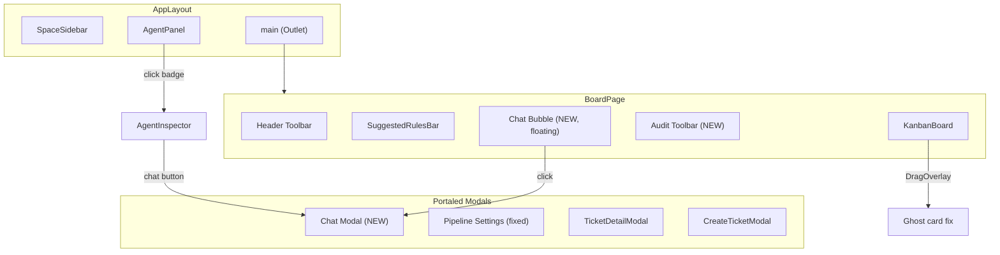

# Design Document: UI Overhaul

## Overview

This design covers nine coordinated UI improvements to the Runa Kanban board application. The changes touch both the React frontend (React 19 + Vite + Tailwind CSS v4 + @dnd-kit/core) and the NestJS backend (TypeORM + PostgreSQL). The primary goals are:

1. Reclaim vertical board space by converting the fixed ChatPanel into a floating bubble + modal pattern.
2. Improve agent selection UX with an avatar-based dropdown.
3. Add observability via an audit toolbar that streams WebSocket events.
4. Enable ticket deletion with a new backend endpoint and frontend confirmation flow.
5. Fix the drag-and-drop ghost card rendering so the original card hides during drag.
6. Surface agent assignment and activity directly on ticket cards.
7. Allow quick chat initiation from the AgentInspector.
8. Fix layout/alignment issues in the PipelineSettings modal.
9. Polish the chat modal styling for a professional look.

All changes are additive or modify existing components in-place. No new pages or routes are introduced.

## Architecture

The existing architecture remains intact: `AppLayout` renders `SpaceSidebar` + `AgentPanel` + `<Outlet>`, where `BoardPage` is the main content. The key architectural changes are:



### Key Architectural Decisions

1. **ChatModal as a portal**: The ChatModal renders via `createPortal` to `document.body`, consistent with AgentInspector and other modals. This avoids z-index stacking issues with the board.

2. **Audit Toolbar state in BoardPage**: The audit toolbar lives as a child of BoardPage with its own local state for events. It subscribes to the same WebSocket events already handled by `useSocketEvents`, but maintains its own event log array.

3. **Delete endpoint as soft addition**: The backend gets a new `DELETE /tickets/:id` endpoint on the existing `TicketsController`. The service method uses TypeORM's `remove()` which cascades to the JSONB comments stored inline.

4. **Chat state lifted to context**: A new `ChatContext` provides `isOpen`, `openChat(agentType?)`, and `closeChat()` so that both the ChatBubble, AgentInspector, and any future entry points can control the modal.

## Components and Interfaces

### New Components

#### `ChatBubble`

- Location: `frontend/src/features/chat/ChatBubble.tsx`
- Props: none (uses ChatContext)
- Renders a fixed-position circular button (bottom-right, `z-40`) with a chat icon
- Shows an unread badge (red dot with count) when `unreadCount > 0`
- Hidden when ChatModal is open

#### `ChatModal`

- Location: `frontend/src/features/chat/ChatModal.tsx`
- Props: none (uses ChatContext)
- Portaled overlay with backdrop + centered panel (max-w-[640px], max-h-[80vh])
- Contains: AgentSelectorDropdown, message list, input area with image attachment
- Reuses existing `useChatMessages` and `useSendChatMessage` hooks

#### `AgentSelectorDropdown`

- Location: `frontend/src/features/chat/AgentSelectorDropdown.tsx`
- Props: `{ value: AgentType; onChange: (agent: AgentType) => void }`
- Custom dropdown showing agent avatar + name for each option
- Uses `getAvatarSrc()` for avatar images

#### `AuditToolbar`

- Location: `frontend/src/features/board/AuditToolbar.tsx`
- Props: `{ spaceId: string }`
- Horizontal bar at bottom of BoardPage, collapsible
- Subscribes to WebSocket events: `execution_action`, `pipeline_completed`, `ticket_created`, `ticket_updated`
- Maintains internal event array (capped at 200 entries)
- Each event row: timestamp, icon, summary text
- Max height with overflow-y-auto

#### `ChatContext`

- Location: `frontend/src/contexts/ChatContext.tsx`
- Provides: `{ isOpen: boolean; selectedAgent: AgentType; unreadCount: number; openChat: (agentType?: AgentType) => void; closeChat: () => void; markRead: () => void }`
- Wraps BoardPage (or placed in AppLayout)

### Modified Components

#### `BoardPage`

- Remove the fixed `<ChatPanel>` section and its `h-80` container
- Add `<ChatBubble />` and `<ChatModal />` (both use ChatContext)
- Add `<AuditToolbar spaceId={spaceId} />` between KanbanBoard and the bottom
- Wrap content with `<ChatProvider>`

#### `TicketCard`

- Add `opacity-0` class when `isDragging` is true (from parent via props) to hide the original during drag
- Add agent avatar display when `ticket.assigneeAgentId` is set (requires resolving agent from `useAgents` data)
- Add spinning border animation when assigned agent is active
- Add delete button (visible on hover) with confirmation dialog
- Accept new props: `agents: Agent[]`, `onDelete: (ticketId: string) => void`

#### `KanbanBoard`

- Pass `isDragging` state to the correct TicketCard in the column (the one matching `activeTicket.id`)
- Pass `agents` list and `onDelete` handler to TicketCard

#### `BoardColumn`

- Forward `activeTicketId`, `agents`, and `onDelete` props to TicketCard children

#### `AgentInspector`

- Add "Chat with [Agent Name]" button in the header
- On click: call `openChat(agent.agentType)` from ChatContext, then call `onClose()`

#### `PipelineSettings`

- Fix toggle alignment: ensure the toggle `<button>` uses `shrink-0` and the row uses `items-center` properly
- Fix toggle knob positioning: adjust `left` offset for the knob `<span>` to prevent clipping
- Ensure consistent padding and border-radius on stage cards

#### `ChatPanel` (deprecated)

- No longer rendered in BoardPage
- Code remains for reference but is unused

### Backend Changes

#### `TicketsController`

- Add `@Delete('tickets/:id')` endpoint
- Calls `ticketsService.delete(id)`
- Returns 204 No Content on success

#### `TicketsService`

- Add `delete(id: string): Promise<void>` method
- Finds ticket by ID (throws NotFoundException if missing)
- Removes ticket via `ticketRepo.remove()`
- Emits `ticket.deleted` event

### New Hooks

#### `useDeleteTicket`

- Location: `frontend/src/api/hooks/useTickets.ts` (add to existing file)
- Mutation: `DELETE /tickets/:id`
- On success: invalidates `['tickets', spaceId]` query

## Data Models

### Existing Models (unchanged)

The `Ticket`, `Agent`, `ChatMessage`, and `ChatAttachment` types remain unchanged. The `Ticket.assigneeAgentId` field is already present and used for agent assignment display.

### New Types

```typescript
// Audit event for the toolbar
interface AuditEvent {
  id: string; // Generated client-side (crypto.randomUUID)
  timestamp: string; // ISO string
  type:
    | "execution_action"
    | "pipeline_completed"
    | "ticket_created"
    | "ticket_updated"
    | "ticket_moved"
    | "agent_triggered";
  summary: string; // Human-readable description
  agentType?: AgentType; // If event is agent-related
  ticketId?: string; // If event is ticket-related
}

// Chat context state
interface ChatContextValue {
  isOpen: boolean;
  selectedAgent: AgentType;
  unreadCount: number;
  openChat: (agentType?: AgentType) => void;
  closeChat: () => void;
  markRead: () => void;
}
```

### Backend API Addition

```
DELETE /tickets/:id
  Auth: JWT required
  Response: 204 No Content
  Error: 404 if ticket not found
```

No database schema changes are required. The ticket entity's JSONB `comments` field is stored inline, so deleting the ticket row removes comments automatically.

## Correctness Properties

_A property is a characteristic or behavior that should hold true across all valid executions of a system — essentially, a formal statement about what the system should do. Properties serve as the bridge between human-readable specifications and machine-verifiable correctness guarantees._

### Property 1: Chat bubble visibility is inverse of modal state

_For any_ sequence of `openChat()` and `closeChat()` calls on the ChatContext, the Chat_Bubble should be visible if and only if `isOpen` is `false`, and the Chat_Modal should be rendered if and only if `isOpen` is `true`.

**Validates: Requirements 1.3, 1.4**

### Property 2: Unread count tracks messages received while modal is closed

_For any_ sequence of incoming chat messages and modal open/close events, the `unreadCount` should equal the number of messages received while `isOpen` was `false` since the last `markRead()` call. Opening the modal and calling `markRead()` should reset the count to zero.

**Validates: Requirements 1.6**

### Property 3: Agent selection updates active agent

_For any_ agent type selected via the AgentSelectorDropdown, the ChatContext's `selectedAgent` value should equal the most recently selected agent type.

**Validates: Requirements 2.3**

### Property 4: Audit events maintain reverse-chronological order

_For any_ sequence of AuditEvent objects added to the Audit_Toolbar, the displayed list should always be ordered by timestamp descending (newest first). Adding a new event should place it at the beginning of the list.

**Validates: Requirements 3.2, 3.3**

### Property 5: Audit event rendering includes required fields

_For any_ AuditEvent with a timestamp, type, and summary, the rendered event row should contain the formatted timestamp string, an event type indicator, and the summary text.

**Validates: Requirements 3.4**

### Property 6: Ticket deletion removes ticket from board state

_For any_ ticket in the board's ticket list, after a successful delete mutation for that ticket's ID, the ticket should no longer appear in the `useTickets` query result for that space.

**Validates: Requirements 4.4**

### Property 7: Backend ticket deletion removes ticket and comments

_For any_ ticket with any number of inline comments, calling `ticketsService.delete(ticket.id)` should result in `findById(ticket.id)` throwing a NotFoundException. The ticket row and its JSONB comments should no longer exist in the database.

**Validates: Requirements 4.6**

### Property 8: Original card hidden during drag

_For any_ TicketCard component, when the `isDragging` prop is `true` (indicating the card's ID matches the active drag), the rendered element should have `opacity-0` or equivalent hidden styling. When `isDragging` is `false`, the element should be fully visible.

**Validates: Requirements 5.1, 5.2, 5.3**

### Property 9: Agent avatar presence matches assignment

_For any_ Ticket, the TicketCard should render an agent avatar image if and only if `ticket.assigneeAgentId` is non-null and resolves to a valid agent. When `assigneeAgentId` is `null`, no avatar element should be present.

**Validates: Requirements 6.1, 6.2**

### Property 10: Spinning border matches agent active status

_For any_ TicketCard whose ticket has a non-null `assigneeAgentId`, the spinning border CSS class should be applied if and only if the resolved agent's `status` is `"active"`. When the agent status is `"idle"` or `"error"`, the spinning border class should not be present.

**Validates: Requirements 6.3, 6.4**

### Property 11: Inspector chat button opens modal with correct agent

_For any_ agent type displayed in the AgentInspector, clicking the "Chat with [Agent Name]" button should result in `openChat()` being called with that agent's `agentType`, so the ChatModal opens with the correct agent pre-selected.

**Validates: Requirements 7.1, 7.2**

### Property 12: Agent messages render with avatar, user messages without

_For any_ ChatMessage, if `role` is `"assistant"` and `agentType` is defined, the message bubble should contain an `` element with `src` matching `getAvatarSrc(agentType)`. If `role` is `"user"`, no agent avatar image should be present in the bubble.

**Validates: Requirements 9.2**

### Property 13: Send button disabled while message is pending

_For any_ state where `sendMessage.isPending` is `true`, the send button in the ChatModal should have the `disabled` attribute set to `true`. When `isPending` is `false` and input is non-empty, the button should not be disabled.

**Validates: Requirements 9.5**

## Error Handling

### Frontend

| Scenario                                         | Handling                                                                                            |
| ------------------------------------------------ | --------------------------------------------------------------------------------------------------- |
| DELETE /tickets/:id fails (network/server error) | Show toast/inline error notification. Retain ticket on board. Do not remove from React Query cache. |
| WebSocket disconnection                          | Audit toolbar stops receiving events but retains existing log. Reconnection resumes event flow.     |
| ChatModal send fails                             | Error state surfaced via `sendMessage.isError`. Send button re-enables. Message remains in input.   |
| Agent not found for assigneeAgentId              | TicketCard gracefully renders without avatar (null-safe check).                                     |
| ChatContext used outside provider                | Throw descriptive error via context default value.                                                  |

### Backend

| Scenario                               | Handling                                                                         |
| -------------------------------------- | -------------------------------------------------------------------------------- |
| DELETE /tickets/:id — ticket not found | Return 404 NotFoundException with message "Ticket not found".                    |
| DELETE /tickets/:id — unauthorized     | Return 401 via existing JWT AuthGuard.                                           |
| DELETE /tickets/:id — database error   | Let NestJS exception filter return 500. Frontend handles via error notification. |

## Testing Strategy

### Property-Based Testing

The project already uses `fast-check` (v4.6.0) in both frontend (vitest) and backend (jest). All correctness properties above will be implemented as property-based tests with a minimum of 100 iterations each.

Each property test must be tagged with a comment referencing the design property:

```
// Feature: ui-overhaul, Property {N}: {property title}
```

**Frontend property tests** (vitest + fast-check):

- Properties 1, 2, 3: Test ChatContext state machine by generating random sequences of open/close/message events and verifying invariants.
- Properties 4, 5: Test AuditToolbar event ordering and rendering by generating random AuditEvent arrays.
- Property 6: Test that the delete mutation hook correctly removes a ticket from the cached list.
- Property 8: Test TicketCard rendering with random `isDragging` boolean values.
- Properties 9, 10: Test TicketCard rendering with random ticket/agent combinations (null/non-null assigneeAgentId, various agent statuses).
- Property 11: Test AgentInspector chat button behavior across all agent types.
- Property 12: Test ChatBubble message rendering with random ChatMessage objects (user vs assistant roles).
- Property 13: Test send button disabled state with random isPending boolean values.

**Backend property tests** (jest + fast-check):

- Property 7: Test ticket deletion by generating random ticket data with random comments, persisting, deleting, and verifying removal.

### Unit Testing

Unit tests complement property tests for specific examples and edge cases:

- ChatBubble renders on initial BoardPage load (Req 1.1)
- ChatModal opens on bubble click (Req 1.2)
- BoardPage no longer renders ChatPanel (Req 1.5)
- AgentSelectorDropdown lists all three agent types (Req 2.1, 2.2)
- AuditToolbar renders in BoardPage (Req 3.1)
- AuditToolbar close/reopen toggle (Req 3.5, 3.6)
- Delete button visible on TicketCard hover (Req 4.1)
- Confirmation dialog appears on delete click (Req 4.2)
- Failed delete retains ticket on board (Req 4.5 — edge case)
- AgentInspector closes when chat button clicked (Req 7.3)
- ChatModal has correct max-width and max-height (Req 9.4)
- ChatModal input area has attachment button, text input, send button (Req 9.3)

### Test File Locations

- `frontend/src/__tests__/chat-context.property.spec.ts` — Properties 1, 2, 3
- `frontend/src/__tests__/audit-toolbar.property.spec.ts` — Properties 4, 5
- `frontend/src/__tests__/ticket-delete.property.spec.ts` — Property 6
- `frontend/src/__tests__/drag-ghost.property.spec.ts` — Property 8
- `frontend/src/__tests__/ticket-card-agent.property.spec.ts` — Properties 9, 10
- `frontend/src/__tests__/inspector-chat.property.spec.ts` — Property 11
- `frontend/src/__tests__/chat-message-avatar.property.spec.ts` — Property 12
- `frontend/src/__tests__/chat-send-button.property.spec.ts` — Property 13
- `backend/src/tickets/__tests__/delete.property.spec.ts` — Property 7
